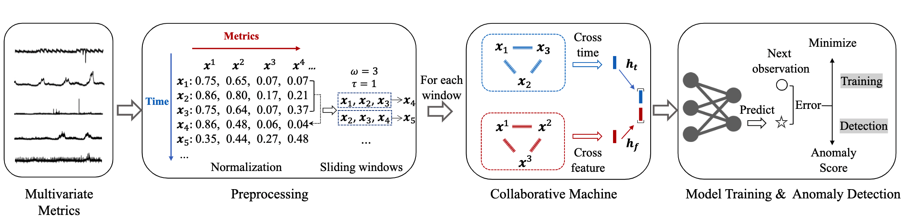

## Replication Package for Paper#78 in ISSRE23

This is the anonymous repository for our **experience paper** #78 titled **Practical Anomaly Detection over Multivariate Monitoring Metrics for Online Services (PER)** submitted to ISSRE23.

We aim to **accurately and efficiently** detect anomalies of complex services monitored by multivariate metrics. Though many studies have been proposed to capture the dependencies between the multivariate metrics to avoid too many false positives, they failed to meet the efficiency requirement in real-world industry, where a large-scale of data points are generated and efficient frequent retraining is demanded. 

The following figure is the framework of CMAnomaly, where the core part is the proposed Collaborative Machine, which can accruately and efficiently capture dependency between different metrics for the subsequent anomaly detection step.



### Dependency

> python >= 3.6
>
> numpy==1.19.5
>
> scikit-learn==0.24.2
>
> torch==1.4.0  

Detailed configuration for pytorch can be found here [Start Locally | PyTorch](https://pytorch.org/get-started/locally/).

### Quick Start

```
python cmanomaly_benchmark.py --dataset industry --lr 0.01 --window_size 32 --stride 5 --nb_epoch 100 --batch_size 1024 --gpu 0
```

Note that if you want to use cpu to train the model, please specify `--gpu -1`

### Repository organization

./benchmark: Entry of the proposed method CMAnomaly

./common: Helper functions and classes

./datasets/anomaly: **Industrial dataset** used in our paper

./networks: detailed implementation of CMAnomaly and baseline models

### Industrial Dataset

The industrial dataset is archived in  ./datasets/anomaly. To evaluate our method in a practical scenario, we collected a 30-day-long monitoring metrics dataset with 13 online services in **real-world production environment of Company H.** Each of the online services has 15∼30 different types of monitoring metrics. **Note that only a portion of the dataset is released due to confidential reasons.**

